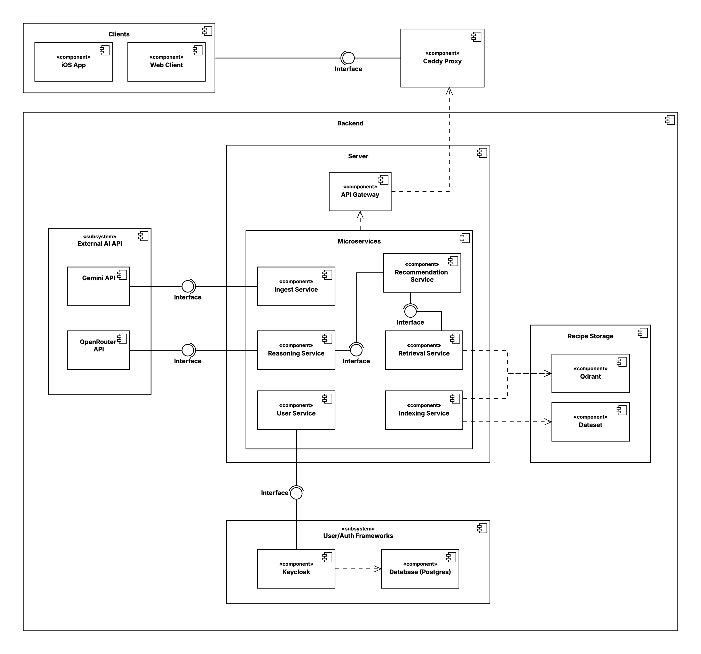
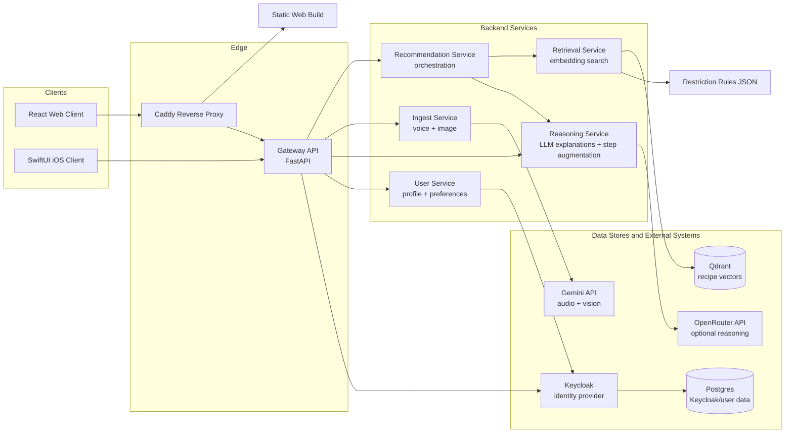

# Dishify

Dishify is an AI-assisted cooking platform that recommends recipes from the ingredients a user already has. It combines vector retrieval, inventory-aware ranking, dietary restriction filtering, optional LLM reasoning, image-based ingredient detection, voice input, and authenticated user preferences behind a single gateway API.

The repository contains the backend microservices, React web client, native iOS client, local infrastructure, data tooling, and API documentation needed to run the system end to end.

## Table of Contents

- [Architecture](#architecture)
- [Repository Layout](#repository-layout)
- [Core Capabilities](#core-capabilities)
- [Technology Stack](#technology-stack)
- [Quick Start](#quick-start)
- [Configuration](#configuration)
- [Data and Indexing](#data-and-indexing)
- [Development](#development)
- [Testing](#testing)
- [Operational Notes](#operational-notes)
- [Troubleshooting](#troubleshooting)
- [Documentation](#documentation)

## Architecture





### Request Flow

1. The web or iOS client authenticates through the gateway.
2. The gateway validates bearer tokens against Keycloak and proxies public API calls.
3. `/recommend` calls the recommendation service.
4. Recommendation calls retrieval for semantic search, ranks results against the pantry, and optionally calls reasoning for explanations.
5. `/voice` and `/vision/ingredients` call the ingest service, which uses Gemini for transcription and ingredient detection.
6. Recipe detail pages can call `/recipes/augment` to generate enhanced directions and tips.

## Repository Layout

```text
dishify/
├── backend/                  # FastAPI services and shared Python packages
│   ├── services/
│   │   ├── gateway/           # Public API, auth validation, service proxying
│   │   ├── recommendation/    # Retrieve/rank/explain orchestration
│   │   ├── retrieval/         # Qdrant vector search
│   │   ├── reasoning/         # LLM explanation and recipe augmentation
│   │   ├── ingest/            # Gemini voice and image ingestion
│   │   ├── indexing/          # Offline indexing worker
│   │   └── user/              # User profile and preferences
│   ├── shared/                # Shared contracts, ranking, vector store packages
│   └── scripts/               # Smoke tests, indexing, evaluation utilities
├── web-client/                # React + Vite web application
├── ios/                       # SwiftUI iOS application
├── keycloak/                  # Realm and client provisioning
├── data/                      # Recipe samples, rules, local data artifacts
├── docs/                      # API contract and integration notes
├── notebooks/                 # Data exploration and cleaning notebooks
├── Caddyfile                  # Reverse proxy routing
└── docker-compose.yml         # Local full-stack orchestration
```

## Core Capabilities

- Pantry-based recipe recommendation.
- Diet, allergy, and restriction filtering.
- Authenticated user accounts, profile, and saved preferences.
- Recipe ranking based on matched and missing ingredients.
- Optional LLM-generated reasoning and step augmentation.
- Voice input for pantry items and cooking intent.
- Image-based ingredient detection from camera or upload.
- Web and iOS clients using the same gateway contract.
- Local Docker Compose stack for full-system development.

## Technology Stack

| Area | Technology |
| --- | --- |
| Web | React, TypeScript, Vite, Mantine |
| iOS | SwiftUI |
| API | FastAPI, Pydantic |
| Auth | Keycloak, JWT bearer tokens |
| Search | Qdrant, sentence-transformers |
| Data | Postgres, recipe CSV samples, restriction rules JSON |
| AI integrations | Gemini, OpenRouter-compatible models |
| Edge | Caddy |
| Local infra | Docker Compose |

## Quick Start

### Prerequisites

- Docker and Docker Compose.
- Node.js 20+ for local web development.
- Python 3.10+ for local backend scripts and tests.
- Optional API keys:
  - `GEMINI_API_KEY` for voice and image ingestion.
  - `OPENROUTER_API_KEY` for LLM explanations and step augmentation.

### 1. Configure Environment

```bash
cp .env.example .env
cp .env.example .env.secret
```

Put real secrets in `.env.secret`. Do not commit `.env.secret`.

Minimum useful local configuration:

```env
GEMINI_API_KEY=...
OPENROUTER_API_KEY=...
KEYCLOAK_ADMIN=admin
KEYCLOAK_ADMIN_PASSWORD=admin-secret
KEYCLOAK_BACKEND_SECRET=backend-secret
KEYCLOAK_PUBLIC_URL=http://localhost:9001
```

### 2. Start the Full Stack

```bash
docker compose up -d --build
curl -s http://localhost:8000/health
```

Expected health response:

```json
{"status":"ok","service":"dishify-backend"}
```

### 3. Open the App

| URL | Purpose |
| --- | --- |
| `http://localhost` | Production web build through Caddy |
| `http://localhost:8000` | Gateway API |
| `http://localhost:9001` | Keycloak |
| `http://localhost:6333` | Qdrant |
| `http://localhost:5173` | Vite dev server, when running web locally |

Default local test user:

```text
username: testuser
password: test-secret
```

### 4. Index the Development Recipe Sample

If `/recommend` reports that `recipes_full` is missing, index the local 10k development sample:

```bash
docker compose run --rm indexing-worker --recreate
```

The full production-scale vector index is expected to be restored from a shared Qdrant volume artifact rather than rebuilt during normal development.

## Configuration

Important environment variables:

| Variable | Used by | Description |
| --- | --- | --- |
| `GEMINI_API_KEY` | ingest | Enables voice transcription and image ingredient detection. |
| `GEMINI_TRANSCRIBE_MODEL` | ingest | Gemini model for audio transcription and voice parsing. |
| `GEMINI_VISION_MODEL` | ingest | Gemini model for image ingredient detection. |
| `OPENROUTER_API_KEY` | reasoning | Enables LLM explanations and recipe step augmentation. |
| `OPENROUTER_MODEL` | reasoning | Model used for reasoning and augmentation. |
| `QDRANT_COLLECTION` | retrieval, indexing | Vector collection name, usually `recipes_full`. |
| `RESTRICTION_RULES_PATH` | retrieval, recommendation, reasoning, user | Path to restriction rules JSON inside containers. |
| `KEYCLOAK_PUBLIC_URL` | gateway, user, clients | Browser/device-visible Keycloak URL. |
| `DISABLE_AUTH` | gateway | Allows local unauthenticated API testing when explicitly enabled. |
| `VITE_API_URL` | web-client build | Gateway base URL baked into Vite builds. Defaults to `http://localhost:8000`. |

See [.env.example](.env.example) for the canonical local template.

## Data and Indexing

| Path | Purpose |
| --- | --- |
| `data/dataset_10000_annotated.csv` | Development recipe sample used by the Docker indexing worker. |
| `data/restriction_rules.json` | Restriction, allergy, and diet rule definitions. |
| `data/qdrant_volume.tar.gz` | Optional shared Qdrant volume archive; should not be committed. |
| `notebooks/data_cleaning/` | Data exploration, normalization, and annotation notebooks. |

Development indexing:

```bash
docker compose run --rm indexing-worker --recreate
```

Host-side indexing scripts are available under `backend/scripts/`, including `index_full_recipes.py` for full-corpus workflows.

## Development

### Web Client

```bash
cd web-client
npm install
npm run dev
```

Open `http://localhost:5173`. The web client talks to the gateway at `http://localhost:8000` unless `VITE_API_URL` is overridden.

### Backend Services

The recommended local backend workflow is Docker Compose:

```bash
docker compose up -d --build
docker compose logs -f gateway recommendation retrieval ingest reasoning user
```

Individual services can also be run with `uvicorn` from their service directories, but Compose is the source of truth for service URLs, volumes, and dependencies.

### iOS Client

Open `ios/Dishify.xcodeproj` in Xcode. The simulator can use `http://localhost:8000`; physical devices need a LAN-reachable gateway URL.

## Testing

### Frontend

```bash
cd web-client
npm test
npm run build
```

Current frontend coverage includes API client behavior, media request routing, pantry storage, auth storage, recommendation session persistence, ingredient formatting, recipe detail rendering, and theme regressions.

### Backend

Backend tests are organized near each service and shared package.

Examples:

```bash
PYTHONPATH=backend/services/recommendation:backend/shared/dishify-contracts \
  pytest backend/services/recommendation/tests -q

PYTHONPATH=backend/services/gateway:backend/shared/dishify-contracts \
  pytest backend/services/gateway/tests -q
```

Some service tests require service-specific dependencies. Running them inside the matching Docker image or a local virtual environment with the service `requirements.txt` installed is recommended.

### Integration Smoke Test

With the Compose stack running and recipes indexed:

```bash
python backend/scripts/smoke_test_api.py
```

## Operational Notes

- Caddy is the public local entry point for the production web build.
- Caddy must proxy all API routes to the gateway, including `/recommend`, `/voice`, `/vision/*`, `/transcribe`, `/recipes/augment`, `/auth/*`, and `/me*`.
- The gateway is the only API surface clients should call directly.
- Retrieval depends on Qdrant and `RESTRICTION_RULES_PATH`.
- Ingest depends on `GEMINI_API_KEY`.
- Reasoning is optional; if no OpenRouter key is configured, deterministic fallback reasoning should still keep recommendation usable.
- Keycloak is provisioned automatically from `keycloak/create-realm.sh`.

## Troubleshooting

### `Could not reach the Dishify API`

Check that the gateway is running and reachable:

```bash
docker compose ps
curl -i http://localhost:8000/health
curl -i http://localhost/health
```

If using the Docker-served web app at `http://localhost`, also verify Caddy routes the API endpoint:

```bash
curl -i http://localhost/voice
curl -i http://localhost/vision/ingredients
```

`405 Method Not Allowed` is acceptable for a `GET`; it means the request reached the FastAPI gateway. Returning HTML means Caddy routed the request to the web container instead of the gateway.

### `httpx.ConnectError: [Errno 111] Connection refused`

This usually means one service is trying to call another service that is not running or not reachable by its Compose service name.

Check service health:

```bash
docker compose ps
docker compose logs gateway recommendation retrieval ingest reasoning user --tail=100
```

Common causes:

- A dependency container exited or is still starting.
- Gateway service URLs do not match Compose service names.
- Caddy is serving a frontend route instead of proxying an API route.
- The stack was rebuilt but not restarted.

### `Qdrant collection 'recipes_full' not found`

Index the development sample:

```bash
docker compose run --rm indexing-worker --recreate
```

For full-corpus usage, restore the shared Qdrant volume instead of indexing locally.

### Media ingestion is disabled

Set `GEMINI_API_KEY` in `.env.secret` and recreate the ingest service:

```bash
docker compose up -d --build ingest gateway
```

### First recommendation is slow

Retrieval warms the embedding model after startup. The first request can be slower than subsequent requests.

## Documentation

- API contract: [docs/API.md](docs/API.md)
- Backend details: [backend/README.md](backend/README.md)
- Web client details: [web-client/README.md](web-client/README.md)
- iOS details: [ios/README.md](ios/README.md)
- Integration notes: [docs/INTEGRATION.md](docs/INTEGRATION.md)
- Agent scope rules: [AGENTS.md](AGENTS.md)

## Security and Secrets

- Do not commit `.env.secret`, API keys, local database dumps, Qdrant archives, or raw full datasets.
- Keycloak and Postgres defaults are for local development only.
- Production deployments should use managed secret storage, TLS, restricted CORS origins, and non-default credentials.

## License

No license file is currently included. Add one before publishing or distributing outside the project team.
