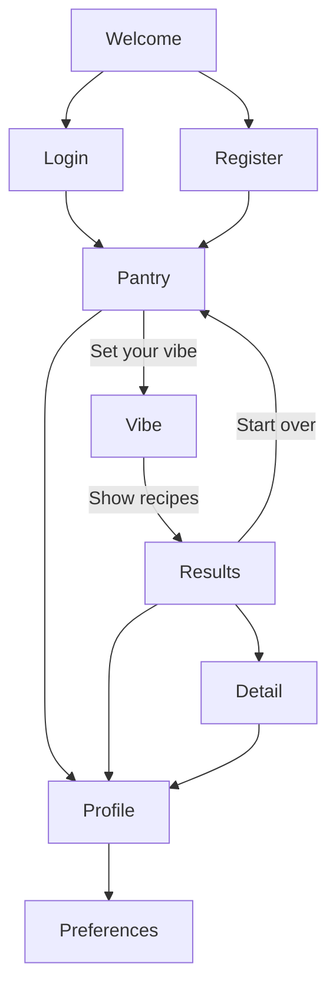

# Dishify iOS

Native SwiftUI client for the Dishify gateway API. The UI follows the mobile Figma mockups with native stack navigation (back buttons, profile icon), while behavior matches the web client.

## Requirements

- macOS with **Xcode 15+** (Swift 5.9+)
- iOS **16.0+** simulator or device
- Backend running locally or on a reachable host — see [`../backend/README.md`](../backend/README.md)

## Open and run

1. Open `Dishify.xcodeproj` in Xcode.
2. Select the **Dishify** scheme.
3. Use build configuration **Debug** for simulator + local backend (`http://localhost:8000`).
4. **Signing:** choose your Apple Developer team under *Signing & Capabilities* (only needed for physical devices / TestFlight).
5. **Run destination:** select an **iOS Simulator** (e.g. iPhone 17 Pro) in the Xcode toolbar — not "Any iOS Device" or "My Mac", which require a development team.
6. Press **Run** (⌘R).

If the build fails with missing types like `VibePage`, run **Product → Clean Build Folder** (⇧⌘K) so Xcode picks up newly added source files.

## Navigation flow



| Screen | Behavior |
|--------|----------|
| **Welcome** | Centered landing with bowl illustration, Log in / Sign up |
| **Pantry** | Ingredient CRUD (local persistence), voice + camera input, profile icon, → Vibe |
| **Vibe** | Natural-language query, top-K, → Results |
| **Results** | Ranked recipe cards, retry, pipeline details, start over |
| **Recipe detail** | Ingredients with MISSING badges, numbered directions (LLM augment) |
| **Profile** | Account info, link to preferences, sign out |
| **Preferences** | 5 restriction sections, chip multi-select, save |

Navigation uses `NavigationStack` with `AppRouter` in [`SessionStore.swift`](Dishify/Core/SessionStore.swift). Authenticated flows are gated behind login (matching web `RequireAuth`).

## What the app does

| Area | Behavior |
|------|----------|
| **Auth** | Register / log in via gateway `POST /auth/register` and `POST /auth/login`. Tokens in UserDefaults; refresh via `POST /auth/refresh`. |
| **Pantry** | Ingredients saved locally (`dishify.pantry`). |
| **Voice** | `POST /voice` — extracts ingredients + vibe from speech. |
| **Camera** | `POST /vision/ingredients` — scan ingredients from photo. |
| **Recommend** | `POST /recommend` with pantry + vibe query. |
| **Preferences** | `GET/PUT /me/preferences`. |

## Project layout

```
ios/
├── Config/                     # xcconfig (Debug, Release, Staging)
├── Dishify.xcodeproj/
├── Dishify/
│   ├── Core/                   # APIClient, SessionStore, Theme, VoiceInputService
│   ├── Features/
│   │   ├── Auth/               # WelcomePage, LoginPage, RegisterPage
│   │   ├── Preferences/        # PreferencesPage
│   │   ├── Recommend/          # PantryPage, VibePage, ResultsPage, RecipeDetailPage
│   │   └── Root/               # RootView, ProfileView
│   ├── Models/
│   └── Assets.xcassets/
└── DishifyTests/
```

## Command line

```bash
cd ios
xcodebuild -scheme Dishify \
  -destination 'generic/platform=iOS Simulator' \
  -configuration Debug \
  -derivedDataPath build/DerivedData \
  CODE_SIGNING_ALLOWED=NO build test
```

## API contract

Networking matches [`../docs/API.md`](../docs/API.md).
