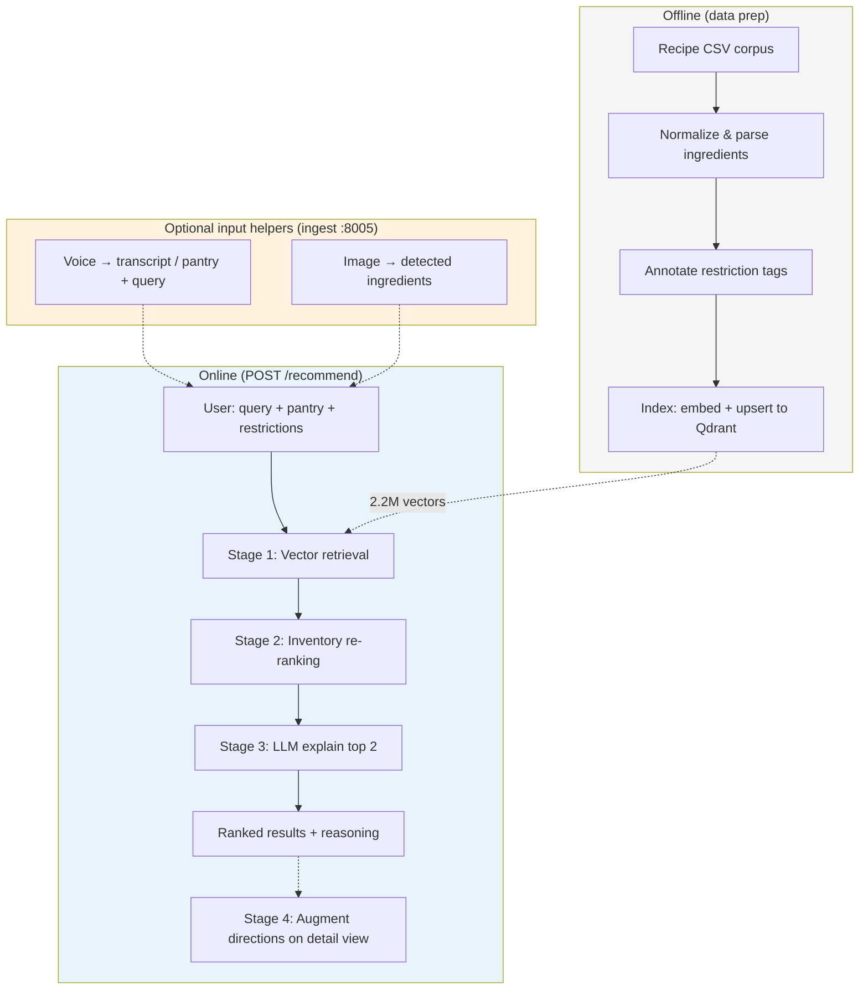
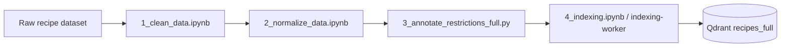
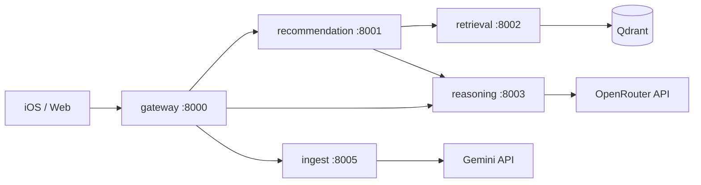

# Dishify AI Pipeline — Presentation Guide

Use this document to explain Dishify's recommendation pipeline in a talk. The **Slide Material** sections at the top are written to fit on 1–2 slides; everything below is speaker notes and backup detail.

---

## Slide 1 — The Problem & Approach

**Title:** *Dishify: AI recipe recommendations from what you have*

**Problem**
- Users have random ingredients at home and dietary constraints (allergies, vegetarian, halal…).
- Keyword search fails: "chicken, rice, tomatoes" doesn't capture *"something quick and comforting"*.
- Safety matters: allergy violations must never slip through on semantic similarity alone.

**Our approach — a 3-stage hybrid pipeline**
1. **Retrieve** — semantic search over **2.2M recipes** (vector DB)
2. **Rank** — re-score by **pantry overlap** (what you actually have)
3. **Explain** *(optional)* — LLM generates **why** each recipe fits + what's missing

**Extended product flow** *(built by teammates on top of the core pipeline)*
- **Input helpers** — voice/image → text & ingredients via Gemini (`ingest` service), then same `/recommend` call
- **Recipe detail** — on-demand LLM expands terse directions into step-by-step instructions (`/recipes/augment`)

```
Pantry + natural-language query + diet/allergy tags
     (optionally filled via voice / fridge photo)
                    ↓
         [1] Vector retrieval (Qdrant)
                    ↓
         [2] Inventory re-ranking
                    ↓
         [3] LLM reasoning (optional, top 2 recipes)
                    ↓
         Ranked recipes with explanations
                    ↓
         [4] Direction augmentation (optional, per recipe on detail view)
```

**Key numbers**
| | |
|---|---|
| Recipe corpus | ~2.23M indexed recipes |
| Embedding model | `all-MiniLM-L6-v2` (384-dim, cosine) |
| Retrieval latency | Sub-second to a few seconds (warm) |
| Ranking weights | 70% semantic + 30% pantry match |

---

## Slide 2 — How Each Stage Works

**Title:** *Retrieve → Rank → Explain*

| Stage | What it does | Why separate? |
|-------|--------------|---------------|
| **1. Retrieve** | Embed query + pantry → nearest neighbors in Qdrant; **hard-filter** unsafe recipes | Fast search at scale; safety via payload filters, not LLM |
| **2. Rank** | Re-order candidates by ingredient overlap (full/partial qty match) | Semantic search finds *similar* recipes; ranking finds *cookable* ones |
| **3. Explain** | LLM reads top results + user context → positive/negative reasoning | Human-readable trust layer; graceful fallback if LLM fails |

**Design choices worth mentioning**
- **Hybrid, not pure LLM** — retrieval/ranking are deterministic and fast; LLM only for explanation (and optional augment).
- **Hard filters before soft ranking** — recipes tagged with user's allergens are excluded at the DB layer (`must_not` filter).
- **Title 2× in embeddings** — recipe title repeated in index text improves named-dish retrieval.
- **Fails gracefully** — if LLM is off or errors, fallback reasoning uses pantry match data.
- **Multimodal is additive** — voice/image helpers fill the same `query` / `available_ingredients` fields; they don't replace vector search.
- **Explain capped at top 2** — only the highest-ranked recipes go to the slow LLM explain stage; rest use fast inventory fallback.

**Example input → output**

*Input:* `"creamy pasta"`, pantry: `[chicken, cream, garlic]`, restrictions: `[nut_allergy]`

*Output:* Top 5 recipes, each with score, matched/missing ingredients, and reasoning like:
- ✅ *Uses cream and garlic you have*
- ⚠️ *You may need: parmesan — easy substitute with nutritional yeast*

---

## Full Pipeline Diagram



---

## Speaker Notes — End-to-End Story (2–3 min)

### Opening hook

> "You open the fridge. You have chicken, cream, and garlic. You want something quick. You're also nut-allergic. Dishify turns that into ranked, explained recipes from a catalog of over two million dishes — in seconds."

### Walk through the three stages

**Stage 1 — Retrieval (the search problem)**

We don't keyword-match "chicken" against ingredient lists. We embed the user's *intent*:

```
Query: creamy pasta
Available ingredients: chicken, cream, garlic
```

That text is encoded with the same model used at index time (`sentence-transformers/all-MiniLM-L6-v2`). Qdrant returns the top-*k* nearest recipe vectors by cosine similarity.

Before similarity search runs, we apply a **hard filter**: any recipe whose pre-computed `exclusion_restrictions` payload overlaps the user's tags (e.g. `nut_allergy`) is excluded. This is a `must_not` filter in Qdrant — not an LLM judgment call. Safety-critical constraints are enforced structurally.

**Stage 2 — Ranking (the practicality problem)**

Semantic search might return "Chicken Alfredo" and "Creamy Tuscan Chicken" — both relevant, but one uses 4/4 pantry items and the other uses 2/4.

We re-score each candidate:

```
final_score = 0.7 × semantic_score + 0.3 × inventory_score
```

`inventory_score` counts how many parsed recipe ingredients match the pantry:
- **Full match** — name + quantity + unit all align
- **Partial match** — name matches, qty/unit missing or insufficient (counts as 0.5)

We also attach `inventory_matched` and `inventory_missing` lists for the UI and for fallback explanations.

**Stage 3 — Explanation (the trust problem)**

Optionally, we send the top-ranked recipes to an LLM (OpenRouter). The prompt includes:
- User's pantry and restrictions
- Full recipe JSON (title, ingredients, directions)

The model returns structured reasoning:

```json
{
  "positive": ["Uses cream and garlic from your pantry", "No tree nuts detected"],
  "negative": ["Missing parmesan — try nutritional yeast"]
}
```

If the LLM is disabled, times out, or errors, we **don't fail the request**. We generate deterministic fallback reasoning from the inventory match fields.

---

## Stage 1 — Vector Retrieval (Detail)

### Offline indexing

| Step | What happens |
|------|--------------|
| Data cleaning | Raw recipe CSV → normalized ingredient names, parsed quantities |
| Restriction annotation | Rule engine (`restriction_rules.json`) tags each recipe with triggered diets/allergies |
| Embedding | Each recipe → 384-dim vector from title (×2) + raw ingredients |
| Storage | Qdrant point: vector + payload (ingredients, directions, restriction tags, etc.) |

**Embedding text per recipe** (index time):

```
Title: Creamy Garlic Chicken
Title: Creamy Garlic Chicken
Raw ingredients: chicken breast, heavy cream, garlic, parmesan, ...
```

Repeating the title weights dish names higher in the embedding space.

### Online retrieval

**Query text** (request time):

```
Query: creamy pasta
Available ingredients: chicken, cream, garlic
```

**Qdrant query:**
- Vector: cosine nearest-neighbor search
- Filter: `must_not` match on `exclusion_restrictions` for user's tags
- Limit: `top_k` (default 5, max 100)

**Tech stack**
- **Qdrant** — vector database (local Docker, ~2.23M points in `recipes_full`)
- **SentenceTransformers** — `all-MiniLM-L6-v2`, 384 dimensions
- **Service** — `backend/services/retrieval/` (port 8002)

### Talking point: why vectors + filters?

> Pure semantic search is great for "vibe" queries but bad at hard constraints. Pure rule engines miss "something like pad thai but mild." We combine both: vectors for relevance, payload filters for safety.

---

## Stage 2 — Inventory Re-Ranking (Detail)

### The problem semantic search doesn't solve

Two recipes can have nearly identical embedding similarity to your query, but one needs 6 ingredients you don't have and the other needs 1.

### Scoring formula

For each retrieved recipe:

1. Parse recipe ingredients (NER-normalized names + optional qty/unit)
2. Compare against user's pantry
3. Compute `inventory_score`:

```
inventory_score = (full_matches + 0.5 × partial_matches) / total_ingredients
```

4. Blend with retrieval score:

```
final_score = semantic_weight × semantic_score + ingredient_weight × inventory_score
             = 0.7 × semantic_score + 0.3 × inventory_score   (defaults)
```

5. Sort descending by `final_score`

### Output fields added per recipe

| Field | Meaning |
|-------|---------|
| `score` | Blended final score |
| `inventory_score` | Pantry overlap ratio (0–1) |
| `inventory_matched` | Ingredients you have |
| `inventory_missing` | Ingredients you'd need to buy |

**Library:** `backend/shared/dishify-ranking/`

### Talking point: tunable weights

> The 70/30 split is configurable. More weight on pantry = "cook with what I have." More weight on semantic = "surprise me, I'll shop." We default toward relevance because users often type vibe queries, but pantry still breaks ties.

---

## Stage 3 — LLM Reasoning (Detail)

### When it runs

- Controlled by `ENABLE_LLM_REASONING=true` on the recommendation service
- Only the **top N ranked recipes** are sent to the LLM (`explain_max_recipes`, default **2**); remaining results use fast inventory fallback
- Calls `backend/services/reasoning/` via internal HTTP

### Prompt structure

The LLM receives:
1. Role: recipe recommendation assistant
2. User context: pantry list + restriction tags
3. Recipe batch: JSON array of top candidates
4. Task: explain fit, flag missing items/substitutions, confirm dietary safety
5. Output schema: JSON with `positive` and `negative` reasoning arrays

### Provider

- **OpenRouter** (default model: `openrouter/free`)
- Configurable via `OPENROUTER_API_KEY`, `OPENROUTER_MODEL`

### Graceful degradation

| LLM state | Behavior |
|-----------|----------|
| Disabled | Stage skipped; fallback reasoning from inventory fields |
| HTTP error / timeout | Stage marked `error`; fallback reasoning used |
| Success | LLM reasoning merged into results by recipe id/title |

**Fallback example:**
- Positive: *"Uses ingredients you have: chicken, cream, garlic."*
- Negative: *"You may need: parmesan."*

### Talking point: LLM as explanation layer, not decision layer

> We never let the LLM choose which recipes to show. It only explains decisions already made by retrieval + ranking. That keeps latency predictable, avoids hallucinated recipe IDs, and means the app works without an API key.

---

## Multimodal Input — Voice & Image (Team Extension)

*Added in API v1.4 by teammate (lincanNerd). Does **not** change the core retrieve → rank → explain pipeline.*

Users can describe their pantry by voice or photograph their fridge instead of typing. These are **two-step helpers**: they produce text/ingredients the client reviews, then the client calls `POST /recommend` as usual.

| Endpoint | Input | Output | LLM |
|----------|-------|--------|-----|
| `POST /transcribe` | Audio (base64) | Natural-language text → goes in `query` | Gemini |
| `POST /voice` | Audio (base64) | Transcript + parsed pantry + residual `query` | Gemini |
| `POST /vision/ingredients` | Image (base64) | Detected `ParsedIngredient` list | Gemini |

**Service:** `backend/services/ingest/` (port **8005**), proxied by gateway  
**Requires:** `GEMINI_API_KEY` (returns `503` if unset)  
**Rate limit:** 20 requests/minute on gateway

### Talking point: why separate from `/recommend`?

> Multimodal parsing is slow and non-deterministic. Keeping it outside the recommend path means text-only users get fast responses, and we can swap Gemini models without touching vector search.

**Example voice flow:**

1. User records: *"I have eggs, milk, spinach, and garlic. Something quick and spicy."*
2. `POST /voice` → `{ ingredients: [...], query: "quick and spicy" }`
3. Client merges into pantry + query field
4. `POST /recommend` → same 3-stage pipeline as always

---

## Recipe Direction Augmentation (Team Extension)

*On-demand LLM step when user opens a recipe detail view — not part of `/recommend`.*

Stored recipe directions in the corpus are often terse. `POST /recipes/augment` (gateway → reasoning service) expands them into:

- Detailed step-by-step instructions with optional per-step tips and durations
- Overall cooking tips
- Estimated total time

**Service:** `backend/services/reasoning/` (`/internal/augment`)  
**Provider:** OpenRouter (same as explain stage)  
**Client:** Web app prefetches augment in background on results page; falls back to original directions if LLM fails

### Talking point

> Augmentation is lazy-loaded per recipe — we don't pay LLM cost for five results when the user only reads one.

---

## Offline Data Pipeline (Optional Slide / Appendix)

If asked *"Where do the 2.2M recipes come from?"*:



| Step | Output |
|------|--------|
| Clean | Deduplicated, valid rows |
| Normalize | Parsed ingredient names, quantities, units |
| Annotate | `exclusion_restrictions` tags from `restriction_rules.json` (~20+ tags: allergies, vegetarian, vegan, halal, kosher, …) |
| Index | 384-dim vectors + metadata in Qdrant |

**Restriction annotation logic:** For each recipe, join normalized ingredient names into text; if any keyword from a restriction rule appears (e.g. `"peanut"` → `nut_allergy`), tag the recipe. At query time, user's selected tags become the exclusion filter.

---

## Request / Response Shape (Demo Slide)

**Request** — `POST /recommend`

```json
{
  "query": "creamy comfort food",
  "top_k": 5,
  "available_ingredients": [
    { "name": "chicken", "quantity": 500, "unit": "g" },
    { "name": "cream" },
    { "name": "garlic" }
  ],
  "exclusion_restrictions": ["nut_allergy"]
}
```

**Response** (simplified)

```json
{
  "results": [
    {
      "rank": 1,
      "title": "Creamy Garlic Chicken",
      "score": 0.82,
      "inventory_matched": ["chicken", "cream", "garlic"],
      "inventory_missing": ["parmesan"],
      "reasoning": {
        "positive": ["Uses all your main ingredients", "No nuts in recipe"],
        "negative": ["Missing parmesan — optional garnish"]
      }
    }
  ],
  "stages": [
    { "name": "retrieve", "status": "ok", "latency_ms": 340 },
    { "name": "rank", "status": "ok", "latency_ms": 2 },
    { "name": "explain", "status": "ok", "latency_ms": 2100 }
  ]
}
```

The `stages` array is useful in demos — it shows retrieval is fast, ranking is negligible, LLM is the slow optional step.

---

## Architecture (Microservices)



| Service | Port | Responsibility |
|---------|------|----------------|
| **gateway** | 8000 | Public API, JWT auth, CORS, rate limiting |
| **recommendation** | 8001 | Orchestrates retrieve → rank → explain |
| **retrieval** | 8002 | Embeddings + Qdrant search |
| **reasoning** | 8003 | LLM explanation + direction augmentation |
| **user** | 8004 | Registration, login, preferences (Postgres) |
| **ingest** | 8005 | Voice transcription + image ingredient detection (Gemini) |

Shared libraries (`dishify-contracts`, `dishify-ranking`, `dishify-vector-store`) keep types and logic consistent across services.

**Core pipeline services** (retrieve → rank → explain) were designed and built by George Trump. **ingest** and **augment** were added by teammates as additive extensions.

---

## Key Design Decisions (Q&A Prep)

| Question | Answer |
|----------|--------|
| Why not ask GPT to pick recipes from 2M? | Impossible context window; slow; non-deterministic; allergy risk |
| Why Qdrant over pgvector / Elasticsearch? | Purpose-built ANN search; payload filtering; scales to millions |
| Why MiniLM-L6-v2? | Small (384-dim), fast on CPU, good enough for short text; ~1–2 min cold load |
| Why hard filters vs. LLM for allergies? | Deterministic, auditable, zero token cost, no hallucination |
| Why re-rank after retrieval instead of embedding pantry into query only? | Query embedding captures intent; explicit overlap scoring is interpretable and tunable |
| What if user has no pantry? | Ranking skipped (semantic order preserved); retrieval still works on query alone |
| What if LLM is down? | Pipeline completes; fallback reasoning from structured match data |
| Why multimodal separate from recommend? | Slow/non-deterministic; keeps core path fast; same `/recommend` contract |
| Why explain only top 2 recipes? | LLM latency/cost; rest get instant inventory-based fallback |

---

## Suggested Presentation Flow (5–7 min)

1. **Hook** (30s) — fridge problem + allergy constraint
2. **Slide 1** (1 min) — 3-stage overview + key numbers
3. **Slide 2** (1.5 min) — table of stages + design choices
4. **Live demo or walkthrough** (2 min) — show request JSON + response with `stages` latencies
5. **Deep dive pick one** (1 min) — either hard filtering *or* ranking formula, depending on audience
6. **Close** (30s) — hybrid = fast + safe + explainable; LLM enhances trust, doesn't drive decisions

---

## One-Liner Summaries (for intro/outro)

- **Elevator pitch:** *"Semantic search over 2 million recipes, re-ranked by what's in your fridge, with optional AI explanations — and hard allergy filters that never rely on the LLM."*

- **Technical summary:** *"Dense retrieval with SentenceTransformers + Qdrant, constraint filtering via payload indexes, linear re-ranking on pantry overlap, and an optional OpenRouter explanation layer with deterministic fallback."*

---

## Reference Files

| Topic | Location |
|-------|----------|
| Pipeline orchestrator | `backend/services/recommendation/app/pipeline.py` |
| Vector store | `backend/shared/dishify-vector-store/dishify_vector_store/vector_store.py` |
| Ranking | `backend/shared/dishify-ranking/dishify_ranking/ranking.py` |
| LLM reasoning + augment | `backend/services/reasoning/app/llm_reasoning.py` |
| Multimodal ingest | `backend/services/ingest/app/routes.py` |
| Restriction rules | `data/restriction_rules.json` |
| Reference notebook | `notebooks/end_to_end_pipeline.ipynb` |
| API contract | `docs/API.md` (v1.4) |

---

*Last updated: 2026-07-08 (synced with `main` — includes multimodal ingest & recipe augment extensions)*
